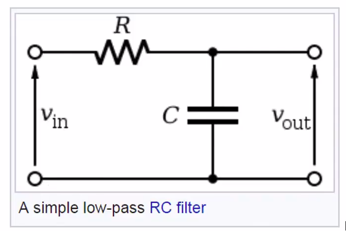
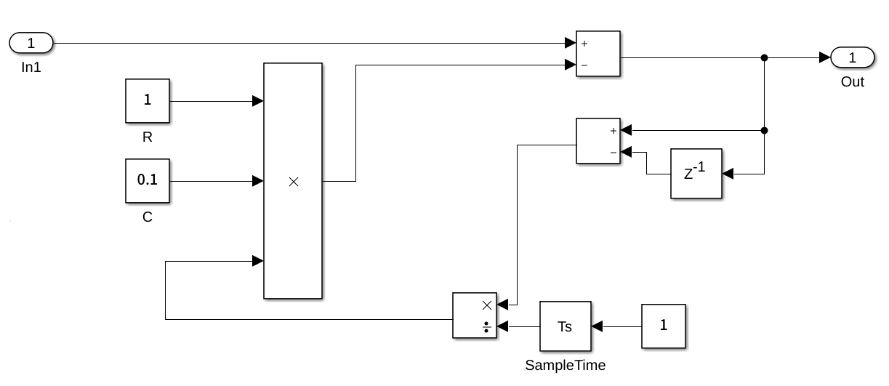
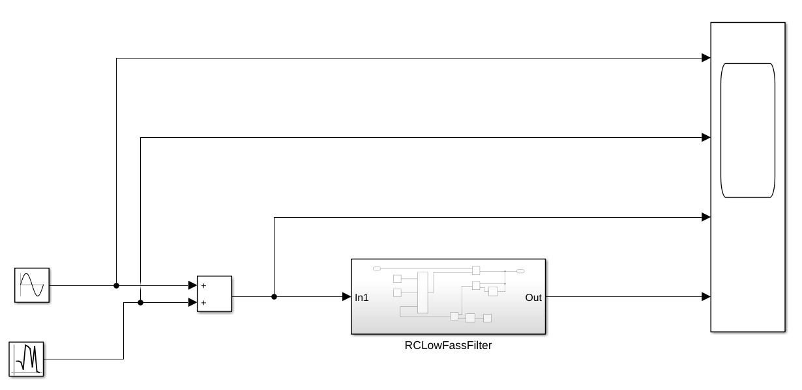
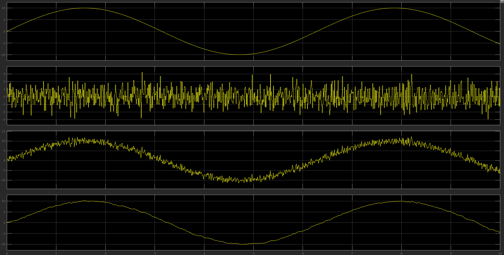

# RC低通滤波器设计文档

## 参考资料：

一个咖喱味的印度人讲的，还算是通俗易懂：[如何在 MATLAB 中使用 Simulink 设计简单的低通 RC 滤波器](https://www.bilibili.com/video/BV1uP4y1p7Se?from=search&seid=10730602609805986110&spm_id_from=333.337.0.0)

## RC低通滤波器原理




$$
v_{in}(t)-v_{out}(t)=Ri(t)
$$

$$
Q_c(t)=Cv_{out}(t)
$$

$$
i(t)=\frac{dQ_c}{dt}
$$

则：
$$
v_{in}(t)-RC\frac{dv_{out}}{dt}=v_{out}
$$

## 搭建simulink模型



## 进行仿真





RC值越大滤波越明显（平滑），但是输出幅值会下降，相位越滞后。

## C++版本程序

```cpp
//RC_LowPassFilter.h
#pragma once

class RC_LowPassFilter
{
private:
    double _last_output = 0;
    double _rcPart = 0;

public:
    RC_LowPassFilter() = default;
    ~RC_LowPassFilter() = default;
    double filter(double raw_input, double dt, double filter_coeff);
};


```

```cpp
//RC_LowPassFilter.cpp
#include "RC_LowPassFilter.h"

double RC_LowPassFilter::filter(double raw_input, double dt, double filter_coeff)
{
    double d_out = raw_input - _last_output;
    _rcPart = filter_coeff * d_out / dt;
    double output = raw_input - _rcPart;
    _last_output = output;
    return output;
}
```

**发现filter_coeff不能超过某个限值，否则会发散。。。**
